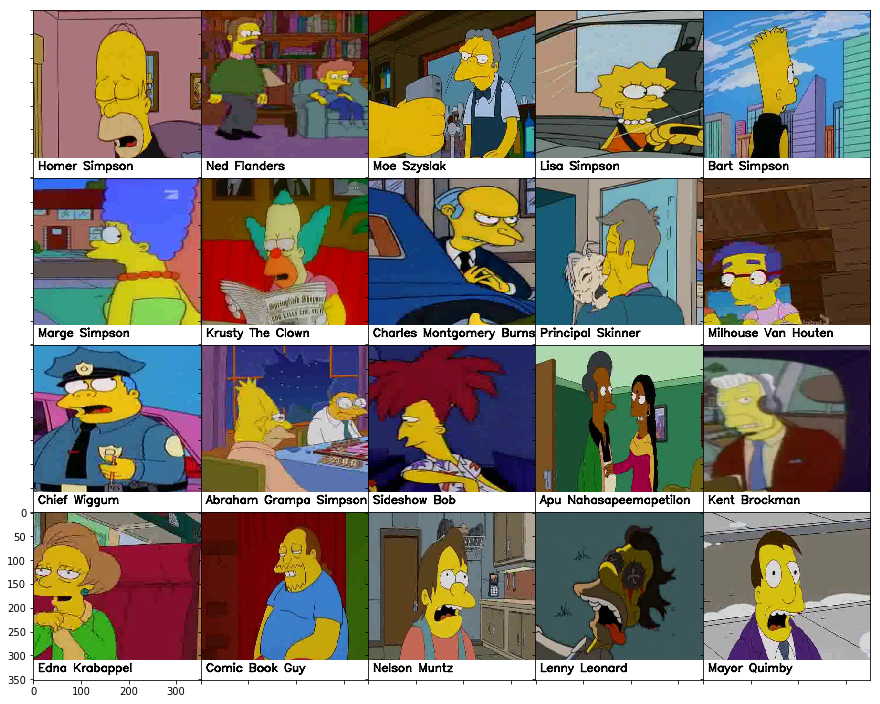

# Ludwig Image Recognizer



Ludwig Image Recognizer is a deep learning project for character recognition in images. The main goal of this project is to recognize characters from the popular TV show "The Simpsons." The model is trained on a large dataset of Simpson character images, allowing it to accurately identify various characters from the show.

## Features

- State-of-the-art deep learning model for character recognition.
- Supports recognition of a wide range of Simpsons characters.
- Easy-to-use API for predicting character labels from new images.
- Pre-trained model checkpoint for quick deployment.

## Installation

To use Ludwig Image Recognizer, follow these simple installation steps:

1. Clone this repository to your local machine.
2. Install the required dependencies using `pip`:
   ```
   pip install -r requirements.txt
   ```

## Usage

Follow these steps to use Ludwig Image Recognizer:

1. Prepare your test images in a separate folder.
2. Use the provided pre-trained model checkpoint or train your own using the training script.
3. Run the prediction script to predict character labels for your test images.

Example usage:
```
python predict.py --model_checkpoint model/checkpoint.pth --test_images_folder test_images
```

## Dataset

The dataset used for training Ludwig Image Recognizer consists of thousands of images of Simpsons characters. Each character's image is labeled with the corresponding character name. The model has been trained extensively on this dataset to achieve high accuracy in character recognition.

## Contributing

We welcome contributions to Ludwig Image Recognizer! If you have any ideas, bug fixes, or improvements, feel free to open an issue or submit a pull request.

## License

This project is licensed under the MIT License - see the [LICENSE](LICENSE) file for details.

## Acknowledgments

- Thanks to the creators of Ludwig, an amazing deep learning framework that made this project possible.
- The Simpsons for providing a delightful and diverse set of characters for this recognition task.

---

Have fun recognizing your favorite Simpsons characters with Ludwig Image Recognizer! If you have any questions or need assistance, feel free to reach out to us. Happy character recognition! 🎉


ludwig train --dataset simpsons.csv --config config.yaml 
             --output_directory results

ludwig train --config config.yaml

ludwig preprocess --config config.yaml --output_directory dataset


ludwig preprocess --dataset image_data.csv  --preprocessing_config preprocessing_config.yaml
ludwig preprocess --config preprocessing_config.yaml --debug

ludwig preprocess --dataset simpsons_dataset --preprocessing_config simpsons_dataset\preprocessing_config.yaml 

ludwig preprocess --preprocessing_config simpsons_dataset\preprocessing_config.yaml --dataset simpsons_dataset


ludwig predict --model_path results\experiment_run_2\model  --dataset test.csv --output_directory results\prediction